# 🧪 In Silico Modeling: Operational Workflow

The In Silico Modeling module provides automated, safe-by-design drug candidate profiling during the preclinical phase of clinical trial automation. It integrates chemical informatics, pharmacokinetics, and AI-driven extraction into a unified pipeline.

## 🔄 End-to-End Workflow

```mermaid
graph TD
    A["📄 Protocol Document (PDF)"] --> B["🤖 Drug Extraction Agent (LLM)"]
    B --> C["💊 Structured Drug Data"]
    
    subgraph "In Silico Engine"
        C --> D["🔍 Chemical Resolver (PubChem)"]
        D --> E["🧬 Toxicity Agent (RDKit)"]
        D --> F["📉 PK/PD Simulator (Mathematical)"]
        C --> G["⚠️ DDI Agent (Rule-based)"]
    end
    
    E --> H["📊 Safety Dashboard"]
    F --> H
    G --> H
    
    H --> I["👑 Candidate Prioritization"]
```

---

## 1. Drug Extraction (LLM-Driven)
**Component**: `DrugExtractionAgent`
- **Logic**: Uses `llama3.1` (via Ollama) with context-aware prompts.
- **Input**: Unstructured protocol text (from PDF extraction).
- **Execution**: Identifies therapeutic agents, dosages, frequencies, and prohibited concomitant medications.
- **Output**: JSON-structured medical profile.

## 2. Chemical Identity Resolution
**Component**: `ChemicalResolver`
- **Logic**: Queries the **PubChem** database via `PubChemPy`.
- **Function**: Maps common drug names (e.g., "Benznidazole") to canonical identities:
    - **SMILES**: Molecular string representation.
    - **CID**: PubChem Compound ID.
    - **Properties**: Molecular weight, formula.
- **Caching**: Local result caching (24h) to minimize external API calls.

## 3. Toxicity Profiling (Predictive)
**Component**: `ToxicityAgent`
- **Logic**: Molecular descriptor analysis using **RDKit**.
- **Metrics**:
    - **Lipinski's Rule of 5**: Violations indicate poor drug-likeness/absorption.
    - **LogP**: Partition coefficient (Lipophilicity).
    - **MW**: Molecular Weight.
    - **TPSA**: Topological Polar Surface Area (Absorption predictor).
- **Classification**: Assigns risk levels (Low/Medium/High) based on heuristic thresholds.

## 4. PK/PD Simulation (Compartmental)
**Component**: `PKPDSimulator`
- **Logic**: Deterministic 1-compartment oral absorption model.
- **Simulation**: Predicts plasma concentration levels (C) over time (t) using:
    - **Ka**: Absorption rate.
    - **Ke**: Elimination rate (derived from half-life).
    - **Vd**: Volume of distribution.
- **Dosing**: Supports multi-dose simulations (e.g., 7-day steady-state analysis).

## 5. Drug-Drug Interaction (DDI)
**Component**: `DDIAgent`
- **Logic**: Cross-reference matching between trial drugs and prohibited/concomitant medications.
- **Reporting**: Identifies CYP450 metabolism interference and synergistic toxicity risks (e.g., Hepatotoxicity).

---

## 📈 Value Proposition
- **Automated Safety Gates**: Identifies dangerous candidates *before* manual review.
- **Evidence-Based Ranking**: Ranks candidates using scientific descriptors rather than just literature mentions.
- **Regulatory Alignment**: Feeds structured safety data directly into FDA Form 1571/1572 automation.
